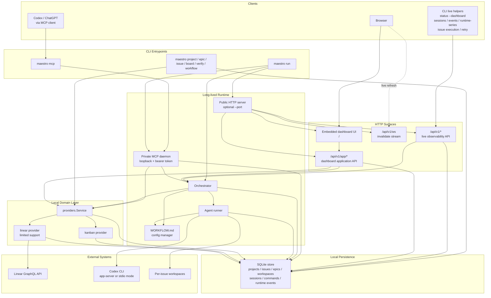

# Maestro Architecture Graph

This graph is derived from the current code structure and runtime behavior in `cmd/maestro`, `internal/orchestrator`, `internal/providers`, `internal/mcp`, `internal/httpserver`, `internal/dashboardapi`, `internal/observability`, and `internal/agent`.

## Reading notes

- `maestro run` is the only long-lived daemon for a database. It owns orchestration, the private MCP daemon, and the optional public HTTP server.
- `maestro mcp` is only a bridge. It discovers the live daemon for the same DB and forwards MCP over stdio.
- The public HTTP server exposes two API layers:
  - `/api/v1/*` for live observability and CLI helpers
  - `/api/v1/app/*` for the embedded dashboard control plane
- Project provider choice lives in the project record, not in `WORKFLOW.md`.
- Even provider-backed issues are synchronized into the local SQLite store and then supervised through the same local runtime.
