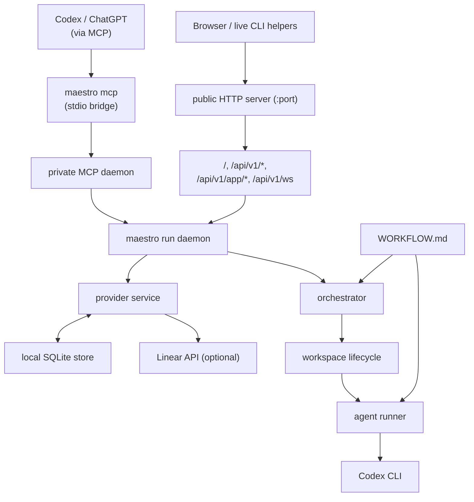

# Maestro Runtime Path Graph

This is the current runtime path distilled from the actual code in `cmd/maestro`, `internal/mcp`, `internal/httpserver`, `internal/dashboardapi`, `internal/observability`, `internal/orchestrator`, `internal/providers`, and `internal/agent`.

## Presentation version

```text
Codex or ChatGPT (via MCP)        Browser / live CLI helpers
            |                               |
            v                               v
   maestro mcp (stdio bridge)      public HTTP server (:port)
            |                               |
            v                               v
    private MCP daemon              /api/v1/*, /api/v1/app/*, /api/v1/ws, /
             \                              /
              \                            /
               v                          v
                    maestro run daemon
                            |
            +---------------+---------------+
            |                               |
            v                               v
 provider service <-> local SQLite store    orchestrator
            |                               |
            |                               v
            |                   workspace lifecycle -> agent runner -> Codex CLI
            |                               ^
            v                               |
      Linear API (optional)            WORKFLOW.md
```

## Mermaid version



## Reading notes

- `maestro mcp` is only a bridge. It forwards MCP traffic into the private daemon owned by `maestro run`.
- The public HTTP server is optional and only exists when `maestro run` is started with `--port`.
- The HTTP surface includes:
  - `/api/v1/*` for live observability and CLI helpers using `--api-url`
  - `/api/v1/app/*` for the embedded dashboard control plane
  - `/api/v1/ws` for dashboard invalidation
  - `/` for the embedded dashboard UI
- The provider service always works through the local SQLite store, even for provider-backed projects.
- Linear is optional and limited. When used, issues are synchronized into the local store before orchestration supervises them.
- `WORKFLOW.md` drives orchestration and agent execution, not provider selection.
